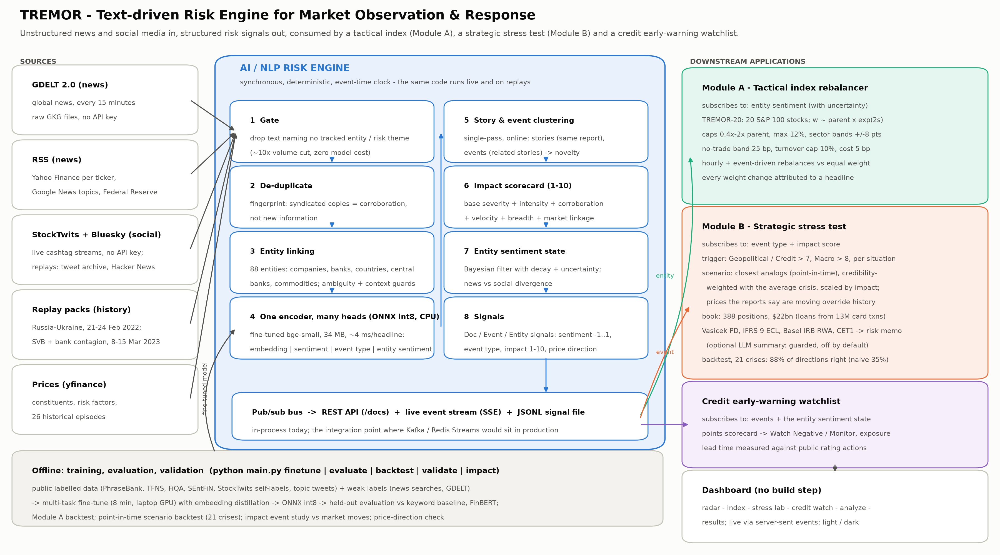
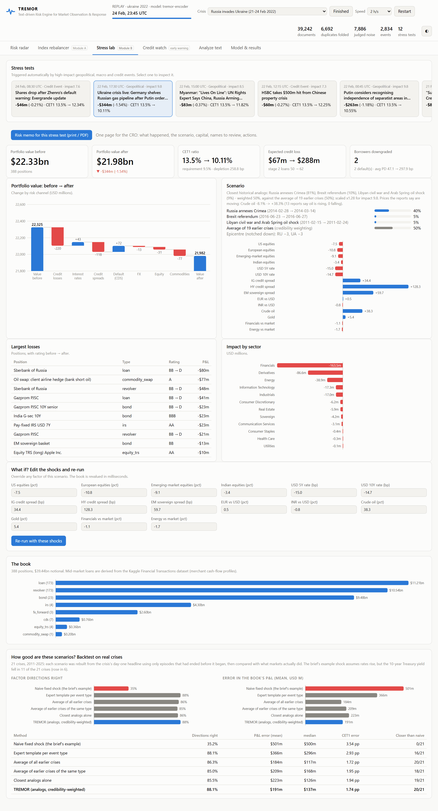
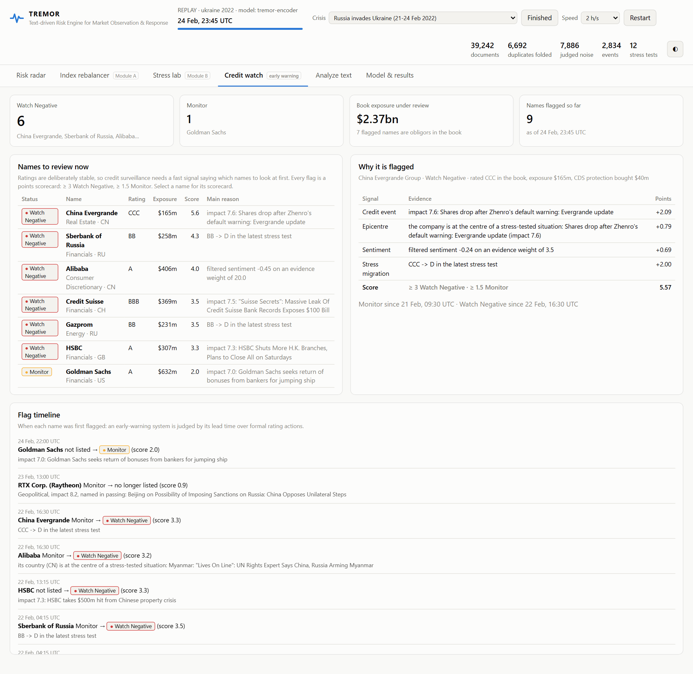
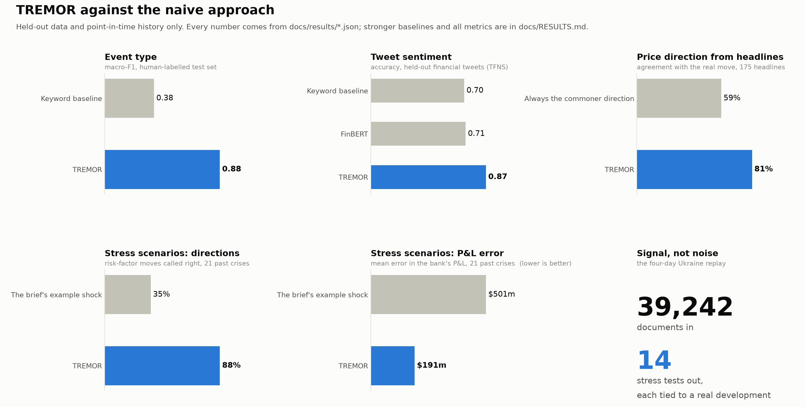

# TREMOR: Text-driven Risk Engine for Market Observation & Response - S&P Global & Crisil Campus Hackathon

**Candidate Name:** Shubham Suman
**College Email ID:** shubhamsuman@kgpian.iitkgp.ac.in
**College / Campus:** IIT Kharagpur
**Demo Video Link:** _to be added (YouTube, unlisted)_
**Slide Deck Link (if hosted externally):** [`docs/presentation.pdf`](docs/presentation.pdf) (in this repository)

---

## 1. Project Overview / Problem Statement & Approach

*New to the project? [`docs/PROJECT_GUIDE.md`](docs/PROJECT_GUIDE.md) explains it in plain language, with diagrams.*

**The problem.** Markets move on news before they move on numbers, but news arrives as an unstructured,
massively duplicated stream: the same wire story is reprinted by hundreds of outlets, most of the
global news flow is irrelevant to any portfolio, and social media is fast but noisy. A risk team needs
to know, within minutes, *which* developments matter, *to whom*, *how much* - and what they mean for its
positions. The brief asks for an AI/NLP engine that turns this text into machine-readable risk signals
(sentiment, event type, impact) and for applications that act on them.

**The approach.** TREMOR is built around four ideas:

1. **Events, not articles.** Documents are clustered into *stories* (one report and its reprints) and
   stories into *events* (one situation). Fifty outlets repeating a headline become one event with fifty
   corroborations, which fixes double counting and turns repetition into evidence. One fine-tuned encoder,
   exported to ONNX and run on CPU, produces four outputs per text in one pass - sentiment, event type,
   entity-level sentiment and the embedding used for clustering.
2. **An impact score that explains itself.** Impact (1-10) is a points-based scorecard, the way credit
   analysts build ratings: a base severity for the event type plus points for severe language,
   *independent* corroboration, velocity, breadth and market linkage, minus points for single-source or
   social-only stories. Every score comes with its line items, and it rises as an event develops, so one
   alarming tweet cannot trigger a stress test.
3. **Applications that behave like the real thing.** Module A is written as an index methodology
   (parent index, tilt, single-stock and sector caps, turnover control, costs, a benchmark). Module B is
   a credit-risk stress test (historical-analog scenarios, Vasicek-shifted PDs, IFRS 9 expected credit
   loss, Basel IRB risk-weighted assets, CET1) on a synthetic wholesale book whose loan sleeve is derived
   from the 13.3M card transactions of the dataset named in the brief, and each test comes with a
   one-page risk memo for the CRO (a local-LLM summary was built with guard rails, measured on every replayed
   stress test and left switched off - section 5). A **credit early-warning watchlist** turns the same signals into the
   list a surveillance team works from: which obligors to review now, why, and the book's exposure to each.
4. **Measured, not asserted.** Every component is compared with a naive baseline on data it did not see:
   the NLP model on held-out test sets (against keywords and FinBERT); the stress-scenario generator in a
   **point-in-time backtest on 21 historical crises** (against the brief's own example shock); the whole
   stack on **two crises of different kinds replayed through unchanged code** - Russia's invasion of
   Ukraine (Feb 2022) and the Silicon Valley Bank run and banking contagion (Mar 2023); and the
   watchlist's flags against the public rating actions of the same weeks.

Both modules are built and they *subscribe* to the engine's signals, as the brief specifies: Module A to
entity sentiment, Module B to event type and impact. The live mode runs on today's feeds; the demo
replays real history through exactly the same code.

## 2. Architecture & Tech Stack



**Data flow.**

1. **Sources** - GDELT 2.0 raw 15-minute files (global news, no key), RSS (Yahoo Finance per ticker, Google
   News topics, Federal Reserve), StockTwits and Bluesky (social; the X API is paid), replay packs of real
   history (news plus a tweet archive or Hacker News), Yahoo Finance prices.
2. **Gate** - a document must name a tracked entity (or carry risk content) to be analysed; this cuts a
   global news firehose by roughly an order of magnitude at zero model cost.
3. **Engine** - de-duplication by text fingerprint; entity linking over 88 entities (companies, banks,
   countries, central banks, commodities) with an ambiguity guard ("Ford" only counts with a finance cue)
   and context exclusions ("U.S. Intel shows ..." is intelligence, not Intel Corp); the multi-task
   encoder; rule cues as a transparent prior, with guards for figures of speech ("a price war", "a
   balance-sheet time bomb") and for domestic politics typed as geopolitics; online story and event
   clustering; the impact scorecard; the **price direction** each report states ("oil soars" = up, read
   from verbs of movement, not from tone); a per-entity Bayesian sentiment state that decays to neutral
   and reports its uncertainty.
4. **Signals** - `DocSignal`, `EventSignal`, `EntitySignal` (Pydantic schemas in `src/tremor/schemas.py`),
   published on an in-process bus, served by a REST API with a live server-sent-event stream, and appended
   to `data/output/signals.jsonl`.
5. **Applications** - A rebalances the TREMOR-20 index; B stress-tests the book when an event crosses the
   threshold and writes a risk memo; the credit watchlist re-scores every tracked company after each
   batch. A dashboard shows all of it live.

**Example signal** (abridged; the top event of the replay, end of 24 Feb 2022):

```json
{"scope": "event", "event_type": "GEOPOLITICAL", "impact_score": 9.9, "sentiment_score": -0.09,
 "headline": "Russian troops try to seize Chernobyl nuclear plant amid…", "regions": ["RU", "UA", "GB", "US"],
 "n_docs": 11344, "n_stories": 2522, "n_publishers": 1937,
 "impact_factors": [
   {"name": "Event type",     "points": 5.0,  "detail": "Geopolitical: base severity"},
   {"name": "Intensity",      "points": 1.15, "detail": "extreme-severity language in 3916/9825 reports; amounts in the billions"},
   {"name": "Corroboration",  "points": 2.0,  "detail": "2522 independent reports across 1937 publishers"},
   {"name": "Velocity",       "points": 1.0,  "detail": "46 new reports in the last hour"},
   {"name": "Breadth",        "points": 0.25, "detail": "9 countries/regions named"},
   {"name": "Market linkage", "points": 0.5,  "detail": "522 reports (5%) discuss markets, prices or listed companies"}],
 "price_moves": {"OIL": {"up": 23, "down": 0}, "GAS": {"up": 15, "down": 0}, "SPX": {"up": 0, "down": 13}}}
```

`price_moves` is direction, not tone: how many reports say each named price is rising or falling. The
stress scenario uses it for oil, gas, gold and US equities.

**Tech stack and why.**

| Layer        | Choice                                                                                                     | Why                                                                                                                                                                                                                                                                                            |
| ------------ | ---------------------------------------------------------------------------------------------------------- | ---------------------------------------------------------------------------------------------------------------------------------------------------------------------------------------------------------------------------------------------------------------------------------------------- |
| Text model   | `BAAI/bge-small-en-v1.5` fine-tuned multi-task (PyTorch, training only) -> ONNX int8                     | Frozen encoders plateau around 0.80 on financial sentiment (8 candidates tested); fine-tuning one small model beats FinBERT on 4 of 5 test sets at 5x its speed                                                                                                                                |
| Inference    | ONNX Runtime + Hugging Face `tokenizers`                                                                  | 34 MB model, no PyTorch or GPU needed to run; ~4 ms per headline                                                                                                                                                                                                                               |
| Service      | FastAPI + Uvicorn, server-sent events                                                                      | typed schemas, auto-generated API docs at `/docs`, live push to the dashboard                                                                                                                                                                                                                 |
| Numerics     | NumPy, pandas, SciPy                                                                                       | vectorised revaluation of the whole book in milliseconds                                                                                                                                                                                                                                       |
| Data         | GDELT, feedparser + requests, yfinance, Kaggle / Hugging Face datasets                                     | free, keyless where possible, reproducible scripts                                                                                                                                                                                                                                             |
| Optional LLM | Ollama, llama3.1, local; **off by default**                                                           | can draft the risk memo's executive summary: placeholders for every figure, checks with up to two repairs, template fallback. On the 33 replayed stress tests: 22 accepted, none with a wrong figure, but the wording still needs a human read, so it stays off ([RESULTS](docs/RESULTS.md) 7c) |
| Dashboard    | plain HTML + ES modules + hand-built SVG charts                                                            | no build step, no CDN: works offline during a live pitch                                                                                                                                                                                                                                       |
| Quality      | pytest (158 tests incl. the full replay through the API and a reproducibility check), ruff, GitHub Actions |                                                                                                                                                                                                                                                                                                |

**API** (interactive docs at `http://127.0.0.1:8000/docs`): `GET /api/events`, `/api/events/{id}`,
`/api/entities`, `/api/entities/{id}`, `/api/documents`, `/api/stream` (SSE), `POST /api/analyze`,
`GET /api/index`, `/api/index/history`, `/api/index/rebalances`, `/api/backtest`, `GET /api/portfolio`,
`/api/stress/runs`, `/api/stress/runs/{id}`, `/api/stress/runs/{id}/memo`, `POST /api/stress/run`,
`GET /api/watchlist`, `/api/replay/*`, `/api/evaluation`.

## 3. Dataset Used

All data is public or synthetic; no proprietary or client data is used. Full data card, sources,
licences and leakage controls: [`data/README.md`](data/README.md).

| Purpose               | Data                                                                                                                                                                                                                                            |
| --------------------- | ----------------------------------------------------------------------------------------------------------------------------------------------------------------------------------------------------------------------------------------------- |
| Live demo (replays)   | **Russia invades Ukraine:** 38,366 GDELT news headlines + 876 timestamped tweets, 21-24 Feb 2022. **SVB and the banking contagion:** 39,240 GDELT headlines + 4,489 Hacker News posts, 8-15 Mar 2023 (`data/replay/`)             |
| Module B portfolio    | Kaggle *Financial Transactions Dataset* (13.3M card transactions, named in the brief) -> cash-flow profiles of 120 merchants -> mid-market loan book; plus large-corporate loans, bonds and derivatives (synthetic, `data/portfolio/`)       |
| Module B scenarios    | 26 historical stress episodes (2001-2025) x 26 risk factors measured from Yahoo Finance, each with a description and a cause-only day-one headline for the point-in-time backtest (`data/scenarios/`, `configs/scenarios.yaml`)             |
| Credit early warning  | 11 public rating actions on Russia (2022) and on SVB, Signature, First Republic and Western Alliance (2023), each with its source; used only to time the watchlist (`data/reference/`)                                                        |
| Module A backtest     | ~49k dated company headlines (Google News archive) + ~63k timestamped tweets, Oct 2021 - Sep 2022; daily prices (`data/prices/`, `data/backtest/`)                                                                                          |
| Training / evaluation | Financial PhraseBank (named in the brief), Twitter Financial News sentiment and topic, FiQA-2018, SEntFiN 1.1, 4k self-labelled StockTwits posts, weak labels from news searches and GDELT (fetched by `scripts/fetch_data.py`, not committed) |

**Key assumptions.** Merchant facility size = 40x annual card turnover (card sales are only part of a
company's revenue); ratings of real companies and all exposure sizes are illustrative; credit-spread moves
of historical episodes are proxied from bond ETFs; backtest headlines are stamped at the end of their day
so nothing is traded before it could have been read. Both replay windows are excluded from all training
data. For 2023, Hacker News stands in for social media (the tweet archive ends in 2022, the X API is paid,
and StockTwits removed the stream of the failed bank's ticker). Rating actions carry dates, not times, so
lead times are counted in calendar days.

## 4. Quickstart & Installation

Runtime: **Python 3.10 - 3.12**, tested from a clean install on **Windows 11** (3.10 and 3.12) and on
**Ubuntu** (3.12, GitHub Actions on every push); CPU only, no API keys, no GPU.

```bash
git clone https://github.com/ShubAce/IITKharagpur-Shubham-Suman-hackathon.git
cd IITKharagpur-Shubham-Suman-hackathon
python -m venv .venv
.venv\Scripts\activate            # macOS / Linux: source .venv/bin/activate
pip install -r requirements.txt
python main.py                    # dashboard on the Feb-2022 crisis replay -> http://127.0.0.1:8000
```

| Command                                                  | What it does                                                                                                                                                               |
| -------------------------------------------------------- | -------------------------------------------------------------------------------------------------------------------------------------------------------------------------- |
| `python main.py`                                       | API + dashboard, replaying 21-24 Feb 2022 at 30 min of history per second (crisis selector, speed and pause in the header)                                                 |
| `python main.py serve --pack svb_2023`                 | the same on the March 2023 bank run (or switch *Crisis* in the dashboard header)                                                                                          |
| `python main.py serve --mode live`                     | the same on live feeds (GDELT, RSS, StockTwits, Bluesky, live prices)                                                                                                      |
| `python main.py replay [--pack svb_2023]`              | run a whole replay headless and print the events, stress tests, watchlist flags and index moves                                                                            |
| `python main.py analyze "Moody's cuts Boeing to junk"` | analyse one text from the command line                                                                                                                                     |
| `python main.py validate`                              | point-in-time backtest of the stress scenarios on 21 historical crises (seconds)                                                                                           |
| `python main.py impact`                                | event study: the impact score against the market's reaction, one year of company news (seconds; `--rebuild` replays the corpus)                                           |
| `python scripts/check_llm_summaries.py`                | optional, needs Ollama: the local LLM's memo summary for every replayed stress test, with the checks' verdicts (minutes)                                                   |
| `pytest`                                               | 158 tests: entity linking, price direction, index methodology, credit math, stress engine, scenario backtest, watchlist, LLM memo guard rails, impact study, pipeline, API |
| `python main.py evaluate`                              | accuracy and speed of every model on held-out data                                                                                                                         |
| `python main.py backtest --rebuild`                    | recompute the one-year Module A backtest                                                                                                                                   |

**Replay or live?** The default is a replay of real history because a quiet day has no event above the
stress threshold (on 3 Oct 2026 the highest live impact was 6.3), and because history has an answer key -
the scenario can be checked against what markets then did. Both modes can run side by side:
`python main.py` (replay, port 8000) and `python main.py serve --mode live --port 8001` (today's feeds).

Rebuilding everything from public data (optional): `pip install -r requirements-dev.txt`, then
`python scripts/fetch_data.py`, `python main.py finetune` (8 minutes on a laptop GPU),
`python main.py evaluate`, `python scripts/build_portfolio.py`, `python scripts/build_analog_library.py`,
`python main.py validate`, `python scripts/validate_price_moves.py`; the replay packs with
`python scripts/build_replay.py` and `python scripts/collect_hn.py` (exact commands in their docstrings);
then `python main.py replay` for each pack and `python scripts/make_results_md.py`.

**Suggested 5-minute demo.** Risk radar: the Russia-Ukraine event climbs from 7.7 to 9.9; open its
scorecard and the *prices the reports say are moving* (oil up, stocks down) -> Stress lab: the escalation
ladder, the scenario (closest analogs + the average crisis), before/after value and CET1, the risk memo,
then the 21-crisis backtest card ("how good are these scenarios?") -> Credit watch: Gazprom and Sberbank
flagged days before S&P cut Russia to junk -> switch *Crisis* to SVB 2023: Silvergate, then SVB on Watch
Negative while both agencies still rated it investment grade -> Analyze text: a headline naming two
companies with opposite news.

<p align="center">
  
  
</p>

*Stress lab and Credit watch on the Ukraine replay. Every tab, in light and dark, and a risk memo:
[`docs/screenshots/`](docs/screenshots/).*

## 5. Key Results & Domain Impact

Full tables, generated from the result files: [`docs/RESULTS.md`](docs/RESULTS.md).



**NLP engine - held-out test sets, real inference path (int8 ONNX on CPU).**

| Task                                        | Keyword baseline (naive) | Frozen encoder + head | FinBERT | **TREMOR** |
| ------------------------------------------- | -----------------------: | --------------------: | ------: | ---------------: |
| News sentiment, PhraseBank (acc.)           |                    0.665 |                 0.765 |  0.879* |  **0.830** |
| Tweet sentiment, TFNS (acc.)                |                    0.703 |                 0.763 |   0.714 |  **0.867** |
| Indian financial news, SEntFiN (acc.)       |                    0.673 |                 0.745 |   0.726 |  **0.870** |
| Target-level sentiment, FiQA (acc.)         |                    0.485 |                 0.665 |   0.533 |  **0.709** |
| StockTwits self-labels, n = 792 (direction) |                    0.420 |                 0.770 |   0.646 |  **0.814** |
| Event type, human labels (macro-F1)         |                    0.377 |                 0.778 |       - |  **0.880** |
| Opposite-sentiment entities in one headline |                    0.453 |                 0.458 |       - |  **0.850** |
| Throughput, docs/s (laptop CPU)             |                    5,218 |                   492 |      61 |    **307** |

\* FinBERT was trained on PhraseBank, so its PhraseBank score is partly in-sample.

**Efficiency vs. the naive and the standard approach.** On the four-day Ukraine replay the engine processed
39,242 documents in 1.5-3 minutes on a laptop CPU (end to end, including clustering, both modules and the
watchlist; 86-192 s across our runs, slower when the laptop was busy or hot) - four days of
news in under three minutes - folded 6,692 syndicated copies into corroboration and discarded 7,834 as
noise. Rolling articles up into events turned 39k documents into scored events of which only **14**
warranted a stress test, on a 34 MB model that needs neither a GPU nor an API key. (Counts are from the
headless replay, `python main.py replay`; in the dashboard the replay is fed in time-sliced batches whose
boundaries depend on the replay speed, so counts and times can differ slightly.)

**Does the impact score measure market impact?** The brief defines it as a predicted severity of market
impact, so we tested exactly that with an event study over the Module A year: 4,867 company-sessions with
news, each scored by the highest impact of an event about the company, against the company's abnormal move
over the sessions around the news. Sessions scored 6 or more moved 2.46% on average against 1.79% for
lower-scored news (+38%; Spearman 0.08, p = 3e-8), so the score does rank market-moving news. But on single
stocks it adds nothing beyond headline volume and tone (regression t = -1.0), and tone intensity alone
correlates better (0.13). The scorecard was built to triage *systemic* events for stress tests, and its
event-type priors carry no single-stock information; fitting its weights to market reactions is the next
step ([`docs/RESULTS.md`](docs/RESULTS.md) section 7b). Module A, the single-stock application, runs on
sentiment - the stronger signal here.

**Module B: are the stress scenarios any good? A point-in-time backtest on 21 crises (2011-2025).** Each
crisis is treated as breaking news: its scenario is rebuilt from its day-one headline (the trigger, never
the market outcome) using only episodes that had ended before it began, and compared with what markets
then did. Full table: [`docs/RESULTS.md`](docs/RESULTS.md) section 6; `python main.py validate`.

| Scenario method                                                                 | Factor directions right | Book P&L error (mean) |       CET1 error | Closer than naive |
| ------------------------------------------------------------------------------- | ----------------------: | --------------------: | ---------------: | ----------------: |
| Naive: the brief's example shock (equities -10%, rates +200 bp)                 |                     35% |                 $501m |           3.5 pp |                 - |
| Expert template per event type (severe-but-plausible)                           |                     88% |                 $366m |           2.9 pp |           16 / 21 |
| Average of all earlier crises                                                   |                     86% |                 $184m |           1.7 pp |           20 / 21 |
| Closest analogs alone (event type + headline similarity)                        |                     86% |                 $223m |           1.9 pp |           19 / 21 |
| **TREMOR: closest analogs, credibility-weighted with the average crisis** |           **88%** |       **$191m** | **1.7 pp** | **20 / 21** |

The naive shock assumes rates rise in a crisis, but the 10-year Treasury yield *fell* in 11 of the 21
crises (a flight to quality) and rose in only 6, so it gets two-thirds of factor directions wrong and
misstates the book's P&L by $500m on average; TREMOR cuts that error by 62%. The backtest also corrected
our own design: retrieving the closest analogs alone was *not* more accurate than simply averaging all
earlier crises (it beat the average in 11 of 21), because with so few episodes it over-commits to one
analog (Ukraine was 83% Crimea). Production now blends the closest analogs 50/50 with the average crisis,
the credibility weighting insurers use for thin experience: it ties the expert templates for the most
directions right (88%, with the best oil call at 75%) and has 14% less P&L error than analogs alone; the
plain average remains marginally lower on mean P&L error ($184m vs $191m), within noise on 21 cases, and
we report it.

**Module B on the crisis.** The Russia-Ukraine situation was stress-tested as it escalated: impact 7.7 on
21 Feb, 8.8 when the US moved to cut Russian banks off, re-runs as coverage nearly doubled and around
Putin's recognition of the separatist regions (9.2), on the invasion itself - *"Putin Announces Military
Assault Against Ukraine in Surprise Speech"*, 24 Feb 05:45 UTC, impact 9.4 - and as coverage reached 539
reports an hour (9.9). Each run shows value before/after, P&L by risk channel, ECL, downgrades (Sberbank
and Gazprom to default at impact 9+, while the bank's CDS protection on Gazprom pays out), CET1 (13.5% ->
10.2% on the invasion, 9.7% at the peak, just above the 9.5% requirement) and a one-page risk memo, whose
opening paragraph we also tried to have a local llama3.1 write: asked to copy figures, it wrote "$267 million"
for a $264m loss and called a 10.66% CET1 ratio "below" the 9.5% requirement. With placeholders, checks and
repairs no wrong figure reaches the memo, but the wording still needs a human read (RESULTS section 7c), so
the summary stays deterministic and the model is off by default. Built
strictly from analogs that ended before the invasion, the final scenario got the direction of **8 of 9**
risk factors right. The first version missed oil: it read the *tone* of the reports as the direction of
the price, and "oil soars on war fears" is a negative sentence about a rising price. The engine now reads
direction from verbs of movement (checked on 175 share-price headlines: 81% agreement with the actual
move, vs 59% for always guessing the commoner direction); in the invasion event 23 reports said oil was
rising and none falling, so the scenario's oil shock went from -12% to +39% (realised: +32%). The euro is
still wrong. At the peak's x1.31 severity the scenario's -$374m loss is about -$285m at x1, against
-$302m when the book is revalued at the moves that actually happened.

**The second crisis: Silicon Valley Bank and the banking contagion (8-15 Mar 2023).** The same code and
thresholds, on 43,728 documents (GDELT news and Hacker News posts; the model never saw this window in
training). Silvergate's wind-down became a credit event at 23:09 UTC on 8 March (impact 7.0); SVB's run
became one at 18:32 UTC on 9 March (*"Banks tumble as SVB ignites broader fears about the sector"*,
impact 7.1), escalated as the shares collapsed (8.8) and when the bank was seized (*"Silicon Valley Bank
seized as depositors pull cash"*, 9.7), and re-ran when Signature Bank was closed; Credit Suisse became
a situation of its own on 15 March. The final scenario again got **8 of 9** factor directions right (the
euro rose), but at impact 9.7 it unlocked Lehman as an analog and overstated the size of the moves
several times over (equities -18% vs -2.5%, high-yield spreads +360 bp vs +111 bp): a severe-but-plausible
stress on the night of 10 March, which the Fed-Treasury-FDIC backstop of 12 March stopped from happening.
Ongoing world news (the war, Iran, North Korea) also triggered geopolitical stress tests that week, as it
would in a live deployment. Full tables: [`docs/RESULTS.md`](docs/RESULTS.md) sections 8 and 9.

**Credit early warning against the rating agencies.** Ratings are deliberately stable - through-the-cycle
and decided by committee - so the value of an early-warning system is telling surveillance teams which
names to review first. On both replays the watchlist flagged the names the agencies then acted on
(public actions with sources in `data/reference/rating_actions.csv`; lead time in calendar days, since the
actions carry dates, not times):

| Name                                 | TREMOR first flag (UTC) | TREMOR Watch Negative (UTC)       | Public rating action                                                                  |             Lead |
| ------------------------------------ | ----------------------- | --------------------------------- | ------------------------------------------------------------------------------------- | ---------------: |
| Russian obligors (Gazprom, Sberbank) | 21 Feb 2022, 09:15      | 22 Feb, 01:15                     | 25 Feb: S&P cuts Russia to BB+ (junk); Moody's puts it on review for downgrade        |           4 days |
| SVB Financial Group                  | 9 Mar 2023, 15:15       | 9 Mar, 19:00                      | 9 Mar: S&P cuts one notch, still investment grade; 10 Mar: bank closed, cut to D / CC | same day / 1 day |
| Signature Bank                       | 9 Mar, 13:45            | 13 Mar, 03:30 (after its closure) | 13 Mar: Moody's cuts it deep into junk after its closure                              |           4 days |
| First Republic Bank                  | 11 Mar, 18:30           | 15 Mar, 15:45                     | 13 Mar: Moody's review for downgrade; 15 Mar: S&P and Fitch cut it to junk            |         2-4 days |

Moody's first one-notch cut of SVB, in the evening of 8 March, came before TREMOR's first flag: the news of
the capital hole broke after the US close that day. Both agencies still rated SVB investment grade when the
watchlist put it on Watch Negative, the day before regulators seized it. The big banks quoted throughout
the coverage (JPMorgan, Bank of America, Wells Fargo) stayed at Monitor: entity-level sentiment and
mention counts separate the subject of a credit event from the names it mentions in passing.

**Module A backtest (Oct 2021 - Sep 2022, bear market, 20 stocks, 5 bp costs).** TREMOR-20 returned
-19.6% vs -19.9% for the equal-weight benchmark (+0.32% a year, information ratio 0.33); the naive
keyword-sentiment tilt lost 0.26% a year. Neither signal's daily information coefficient is statistically
distinguishable from zero over one year (TREMOR +0.005, t = 0.3; naive +0.008, t = 0.5), and an earlier
training run of the same model gave +0.63% - so the honest reading is that one year of 20 stocks cannot
establish alpha either way. The backtest demonstrates an investable, cost-aware, look-ahead-free
methodology; proving a durable signal needs a longer, broader sample.

**Domain impact.** For an index provider, the methodology shows how a sentiment overlay can be run as a
rules-based, capped, low-turnover index with every weight change traceable to its source - the governance
an index committee needs. For a credit-risk and ratings business, TREMOR is an early-warning and
stress-testing system: the watchlist flagged the obligors of both crises days before the formal rating
actions, each flag with its scorecard and the book's exposure; the stress test converts a detected event
into scenario-consistent, explainable estimates of losses, provisions and capital, validated on 21 past
crises; and the risk memo answers, on one page, the questions a CRO asks the morning a crisis breaks. The
entity-level sentiment, trained partly on Indian financial news (SEntFiN), and the INR / Indian sovereign
/ Indian corporate exposures make it directly relevant to Indian markets.

**Limitations and next steps.** Ratings and exposures are illustrative. The impact score ranks market-moving
news but carries no information beyond attention and tone on single stocks (event study above) - next: fit
its weights to market reactions. Analog scenarios inherit the gaps of
history: the euro's direction was wrong in both replays, and in the 2023 replay impact 9.7 unlocked
Lehman as an analog and overstated the moves - next: make the extreme-analog gate require evidence of
contagion, and add an LLM "scenario reviewer" for narrative and plausibility checks on the rare
high-impact events. A local LLM can draft the memo's summary without a wrong figure, but its wording still
needs a human read, so it ships switched off - next: test stronger models with the same script. The scenario backtest has 21 crises: among history-based methods the differences are
within noise, and the 50/50 credibility weight is a prior choice, not a fitted one. The watchlist's
thresholds are expert-set, like the impact scorecard, and were refined while looking at these two crises
(for instance, how much of a story must speak of a bank negatively before it counts as the story's
subject), so its lead times are illustrations, not an out-of-sample test - testing it on further crises
is the next step. The model
types political coverage as geopolitical; a rule now catches it when no foreign actor is named, but broad
geopolitical clusters can still absorb unrelated stories through broad countries (a UK story about SVB
headlined an Iran situation in the 2023 replay) - next: down-weight broad countries as clustering anchors
and retrain with political and idiom examples (the figure-of-speech guards for "war" and "time bomb" are
rules today). Replays start cold, so an ongoing situation is rediscovered as new in its first hour. The
Module A backtest covers one year; RSS and search archives give dates but not exact times; the in-process
bus would become Kafka or Redis Streams in production; GDELT coverage is English-language here, while
GDELT covers 100+ languages (a multilingual encoder is the next step).

---

**AI usage.** This project was built with AI assistance (Anthropic Claude) for code and documentation, in
line with the hackathon's AI-usage guideline. Design decisions, data, model training and every reported
number are reproducible from the scripts in this repository.

**Repository layout.**

```
main.py                    entry point (serve | replay | analyze | evaluate | validate | impact | backtest | train | finetune)
configs/                   universe (entities), taxonomy (events, cues), scenarios (factors, episodes), settings
src/tremor/
  ingestion/               GDELT, RSS, StockTwits, Bluesky, replay, prices
  nlp/                     entity linking, cues, price direction, encoder, models, impact scorecard
  engine/                  clustering, sentiment state, pipeline, runtime (bus, store)
  modules/rebalancer/      Module A: methodology, live index, backtest
  modules/stress/          Module B: portfolio, credit math, scenarios, stress engine, scenario backtest, risk memo (+ optional LLM summary)
  modules/watchlist.py     credit early-warning watchlist
  training/                corpora, fine-tuning, evaluation, impact event study
  api/                     FastAPI app + dashboard (static)
models/tremor-encoder/     the fine-tuned model (int8 ONNX, 34 MB) and its metadata
data/                      everything the prototype runs on (see data/README.md)
scripts/                   data collection (GDELT replays, Hacker News, prices), builders, validations, benchmarks, diagrams
docs/                      architecture.png, results_at_a_glance.png, PROJECT_GUIDE.md (plain-language walkthrough
                           with diagrams), RESULTS.md, results/*.json, diagrams/, screenshots/, presentation.pdf
tests/                     pytest suite
```

Licence: MIT.
