# TREMOR, explained simply

*S&P Global & Crisil Campus Hackathon 2026 · Shubham Suman, IIT Kharagpur*

> **In one breath.** TREMOR reads financial news and social media as they arrive and works out three
> things: what is happening, who it affects, and how serious it is. It then acts on that. It re-weights a
> 20-stock index (Module A), and when something big happens it stress-tests a bank's loan book
> (Module B). Everything runs on an ordinary laptop, with no GPU and no paid API keys.

**Contents**

1. [What the hackathon asked for](#1-what-the-hackathon-asked-for)
2. [What we have to deliver](#2-what-we-have-to-deliver)
3. [Our idea in one picture](#3-our-idea-in-one-picture)
4. [How we built it](#4-how-we-built-it)
5. [The engine, step by step](#5-the-engine-step-by-step)
6. [Module A - the index that listens to the news](#6-module-a---the-index-that-listens-to-the-news)
7. [Module B - the stress test that fires on big events](#7-module-b---the-stress-test-that-fires-on-big-events)
8. [The dashboard](#8-the-dashboard)
9. [Results in plain numbers](#9-results-in-plain-numbers)
10. [Replay or live - why the demo shows February 2022](#10-replay-or-live---why-the-demo-shows-february-2022)
11. [How to run it](#11-how-to-run-it)
12. [Where everything lives](#12-where-everything-lives)
13. [Limitations and next steps](#13-limitations-and-next-steps)
14. [Glossary](#14-glossary)

---

## 1. What the hackathon asked for

**In short:** build an AI engine that turns news and social media into risk signals, then build at
least one application that uses those signals.

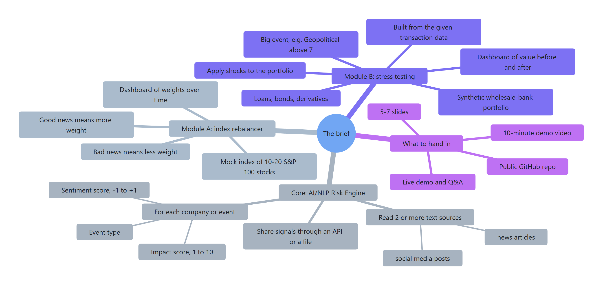

**The goal.** A platform that reads *unstructured* text (news articles, posts) in real time and turns it
into *structured* risk signals that other programs can use.

**Part 1 - the core, required: an AI/NLP Risk Engine**

| Requirement                       | What it means in simple words                                                                                |
| --------------------------------- | ------------------------------------------------------------------------------------------------------------ |
| Read at least two kinds of source | e.g. news articles**and** tweets                                                                       |
| Sentiment score                   | is the news good or bad? A number from -1 (very bad) to +1 (very good)                                       |
| Event classification              | what kind of event is it? e.g. Geopolitical, Macroeconomic, Credit event, Merger/Acquisition, Product launch |
| Impact score                      | how much could it move markets? 1 (nothing) to 10 (huge)                                                     |
| Output                            | make the signals available to other programs, e.g. through an API or a file                                  |

**Part 2 - at least one application. We built both.**

|            | Module A: tactical index rebalancing                    | Module B: strategic portfolio stress testing                                                                                                         |
| ---------- | ------------------------------------------------------- | ---------------------------------------------------------------------------------------------------------------------------------------------------- |
| What it is | a mock index of 10-20 stocks from the S&P 100           | a synthetic portfolio of wholesale-bank assets (loans, bonds, derivatives) built from the transaction data the brief provides                        |
| Listens to | the sentiment score                                     | the event type and impact score                                                                                                                      |
| Rule       | good news: raise the stock's weight; bad news: lower it | a big event (e.g. Geopolitical with impact above 7) triggers a "stress test": shocks such as "equities -10%, rates +2%" are applied to the portfolio |
| Must show  | a dashboard of the weights changing over time           | a dashboard of the portfolio's value before and after                                                                                                |

**Data the brief suggested, and what we used**

| Suggested                                 | Used?                                                               |
| ----------------------------------------- | ------------------------------------------------------------------- |
| GDELT (global news, every 15 minutes)     | yes - live, and for the February 2022 replay                        |
| Kaggle financial-news sentiment datasets  | yes - Financial PhraseBank, plus other public sets (section 5.3)    |
| Historical stock tweets (Kaggle)          | yes - for the replay, the backtest and for studying noise           |
| yfinance (Yahoo Finance prices)           | yes - index prices, and the history of 26 past crises               |
| Kaggle Financial Transactions Dataset     | yes - it is where Module B's loan book comes from                   |
| NewsAPI, Alpha Vantage, Open Banking data | not needed - keyless RSS feeds and yfinance covered the same ground |

---

## 2. What we have to deliver

**In short:** a public GitHub repo with code, data and docs; slides; a demo video; and a live pitch.

| # | Deliverable                | Rules from the guidelines                                                                                                                                             | Where                     | Status                                                                            |
| - | -------------------------- | --------------------------------------------------------------------------------------------------------------------------------------------------------------------- | ------------------------- | --------------------------------------------------------------------------------- |
| 1 | Source code + architecture | public GitHub repo named`<college>-<name>-hackathon`; dependencies and run commands stated                                                                          | GitHub                    | code ready;**you** create and push `IITKharagpur-Shubham-Suman-hackathon` |
| 2 | README                     | the mandatory template: name, college email, college, video link, slide link, then sections 1-5                                                                       | `README.md`             | done (video link still to add)                                                    |
| 3 | Licence                    | MIT recommended; the repo must be public                                                                                                                              | `LICENSE`               | done                                                                              |
| 4 | Data                       | every CSV/JSON used, including synthetic data; no proprietary data                                                                                                    | `data/`                 | done                                                                              |
| 5 | Architecture diagram       | high resolution                                                                                                                                                       | `docs/architecture.png` | done                                                                              |
| 6 | Slides                     | 5-7 slides: title, problem and approach, system design, implementation, key results (**with efficiency gains vs a naive approach**), domain impact, limitations | `docs/presentation.pdf` | **you**                                                                     |
| 7 | Demo video                 | about 10 minutes, YouTube*unlisted*, link in the README                                                                                                             | README                    | **you**                                                                     |
| 8 | Live jury pitch            | a live demo of at most 5 minutes, then technical questions                                                                                                            | online                    | **you** - the script is in `PRESENTER_NOTES.md` (private)                 |

**Rules that matter**

- **Disqualified if:** the repo is private; the video or slide links are broken or restricted (no Google
  Drive or OneDrive links); you miss the pitch; work is copied; real confidential client data is used.
- **Tie-breaker:** first Domain Understanding, then Presentation & Communication, then the earlier submission.
- **Good practice:** keep large binary dumps out of the repo; prefer several commits that show the build
  over one big final commit; AI help is allowed if you are honest about it.

---

## 3. Our idea in one picture

**In short:** sources go into one engine; the engine publishes signals; two modules act on them; a
dashboard shows everything live.

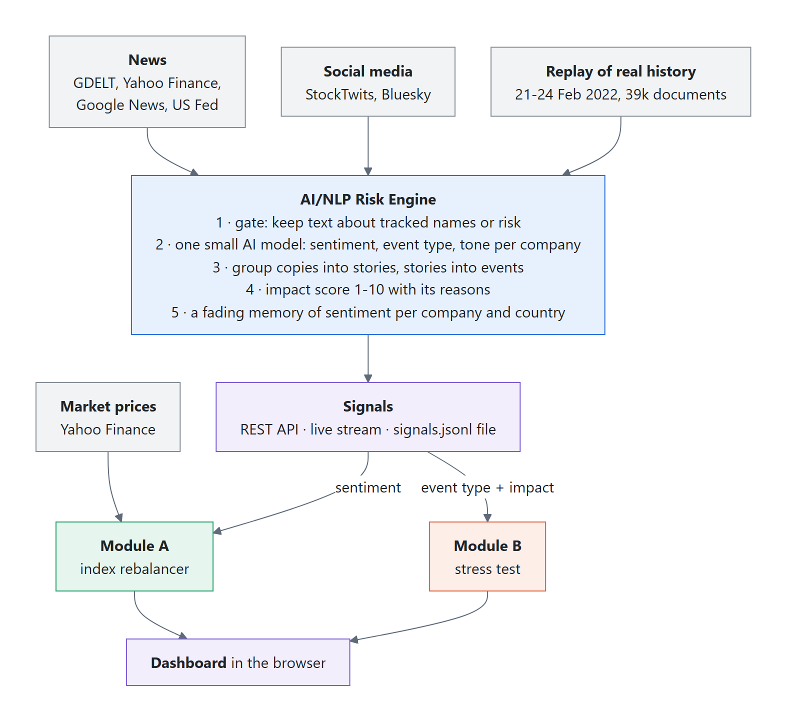

The full technical architecture diagram (also in the README):


Three ideas make TREMOR different from "run a sentiment model on every headline":

1. **Events, not articles.** The same news is reprinted by hundreds of websites. We group copies into
   *stories* and stories into *events*. Fifty sites repeating one headline become one event with fifty
   confirmations: no double counting, and repetition becomes evidence.
2. **An impact score that explains itself.** Impact is a points-based scorecard, like the scorecards
   credit analysts use for ratings. Every score lists its reasons, and it rises only as an event is
   confirmed, so one alarming tweet cannot trigger a stress test.
3. **Applications that behave like the real thing.** Module A follows the rules a real index provider
   uses (weight caps, turnover limits, trading costs). Module B uses the maths banks actually use
   (default probabilities, expected credit loss, capital ratios).

---

## 4. How we built it

**In short:** eight steps, each checked against a simple baseline before moving on.

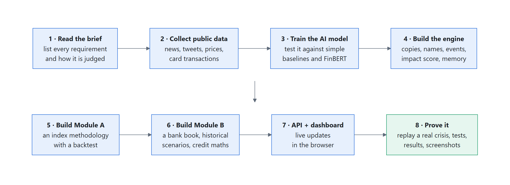

1. **Read the brief** and the submission guidelines, and list every requirement and judging signal.
2. **Collect public data**: news archives (GDELT), tweets, labelled sentiment datasets, Yahoo Finance
   prices and the 13.3M card transactions. Scripts download everything again from scratch
   (`scripts/fetch_data.py`).
3. **Train one small AI model** and test it on data it never saw, against a keyword baseline (the
   naive approach), a frozen model, and FinBERT (the most-used open financial model).
4. **Build the engine**: de-duplication, entity linking, event grouping, the impact scorecard and a
   memory of sentiment per company.
5. **Build Module A**, written as an index methodology, with a one-year backtest.
6. **Build Module B**: a synthetic bank book, a library of 26 real past crises, and the credit maths.
7. **Add an API and a dashboard** that update live in the browser.
8. **Prove it**: replay a real crisis (the Russian invasion of Ukraine) through the exact live code,
   check the results against what markets really did, and run 84 automated tests.

The project was built with AI assistance (Claude), which the guidelines allow. Every number in this
guide comes from scripts in the repository and can be reproduced.

---

## 5. The engine, step by step

### 5.1 Where the text comes from

| Source                    | What it gives                                                     | How often                | Key needed? |
| ------------------------- | ----------------------------------------------------------------- | ------------------------ | ----------- |
| **GDELT** raw files | world news headlines with links                                   | every 15 minutes         | no          |
| **RSS feeds**       | Yahoo Finance (per stock), Google News topics, US Federal Reserve | every few minutes        | no          |
| **StockTwits**      | posts by traders about each stock                                 | every few minutes        | no          |
| **Bluesky**         | public posts that mention our companies                           | every few minutes        | no          |
| **Yahoo Finance**   | stock prices for the index                                        | live                     | no          |
| **Replay pack**     | 38,366 real headlines + 876 tweets from 21-24 Feb 2022            | played back at any speed | no          |

*X (Twitter) is not used live because its API is paid; StockTwits and Bluesky are free.*

### 5.2 The journey of one headline

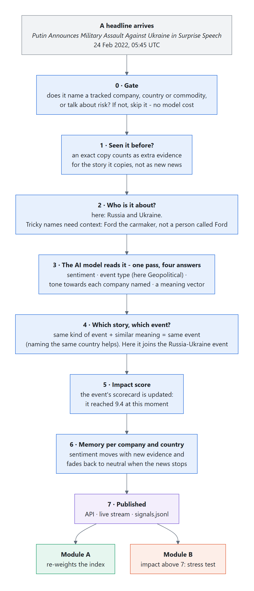

### 5.3 One small AI model doing four jobs

Most projects use a separate model for each job. We **fine-tuned one small model** to do all four at
once. That makes it fast, small and consistent.

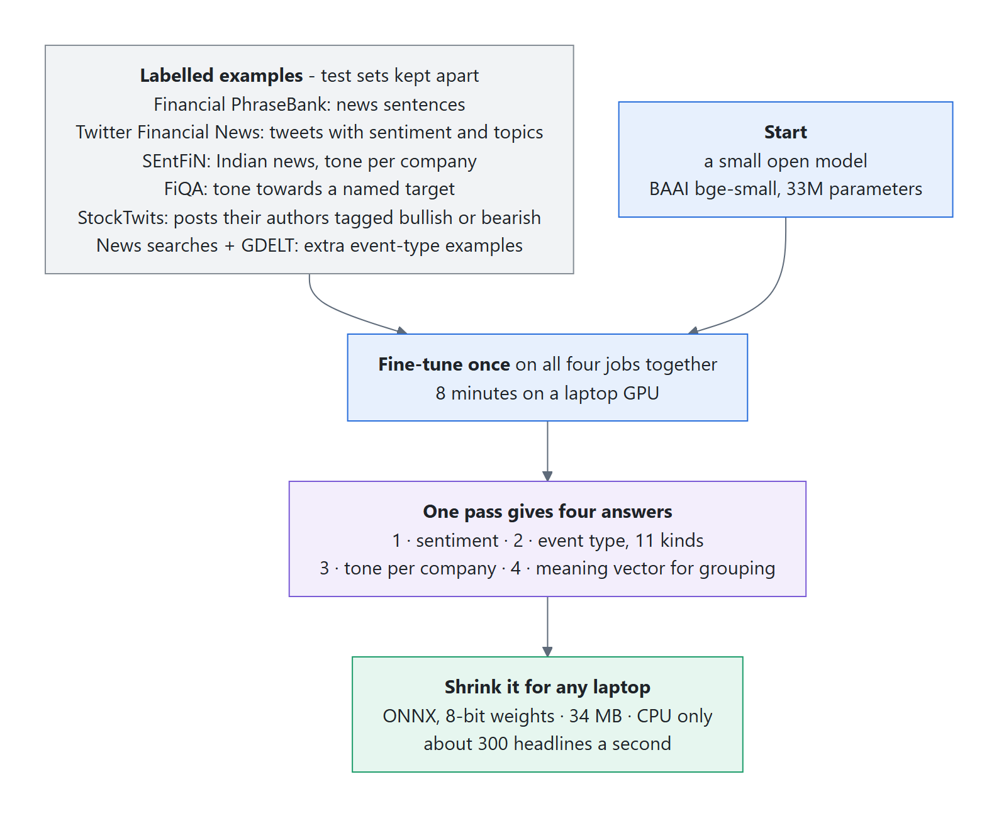

- **Why not FinBERT?** FinBERT only does news sentiment. It has no event type and no per-company
  tone, it is 13 times bigger (438 MB), and on our tests it is 5 times slower. It is also *less*
  accurate on tweets, Indian news and targeted sentiment (section 9).
- **Why not a large language model (LLM) for every headline?** It would be slow and costly, and it can
  give different answers on different runs. An LLM is better used later for the few high-impact events
  (see section 13).
- **Fair testing:** every dataset has a fixed test split that is never used in training, and any
  training text that also appears in a test set is removed.

### 5.4 Events, not articles

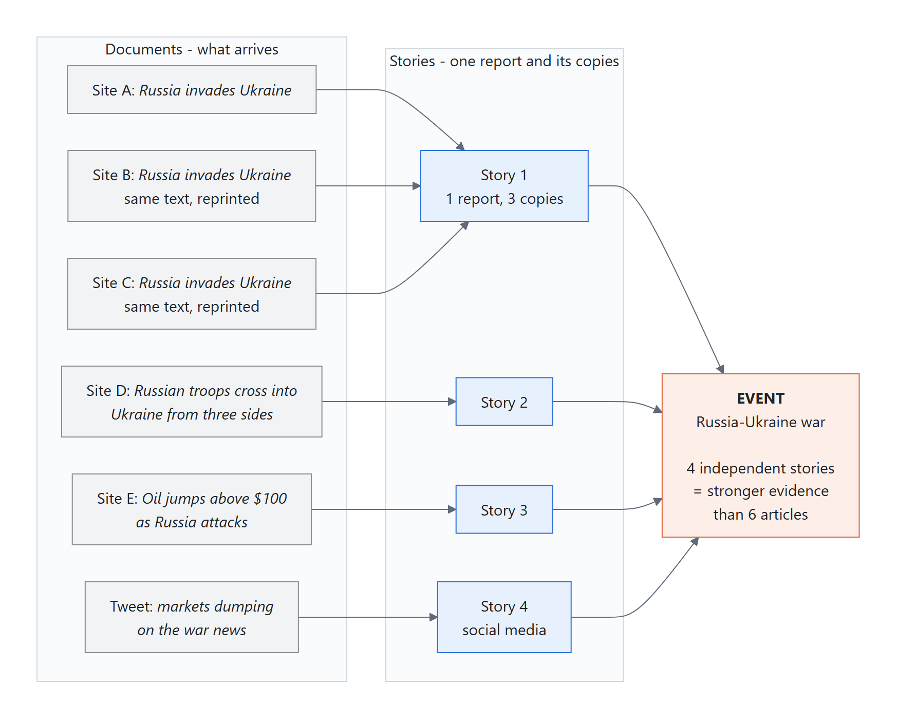

- **Copies:** an exact copy (after removing punctuation and capitals) is not analysed again. It is
  counted as one more confirmation of the story it copies.
- **Stories:** reports that say the same thing in different words.
- **Events:** stories about the same situation, of the same kind (for example Geopolitical). Naming the
  same country or company makes it easier to join. A company event (such as earnings) never merges
  across different companies.
- **Why it matters:** "2,522 independent stories from 1,937 publishers" is real evidence.
  "11,344 articles" alone could just be one press release copied many times.

### 5.5 The impact score - a scorecard you can read

Every event gets points. Here is the real scorecard of the biggest event in the replay (the evening of
24 Feb 2022):

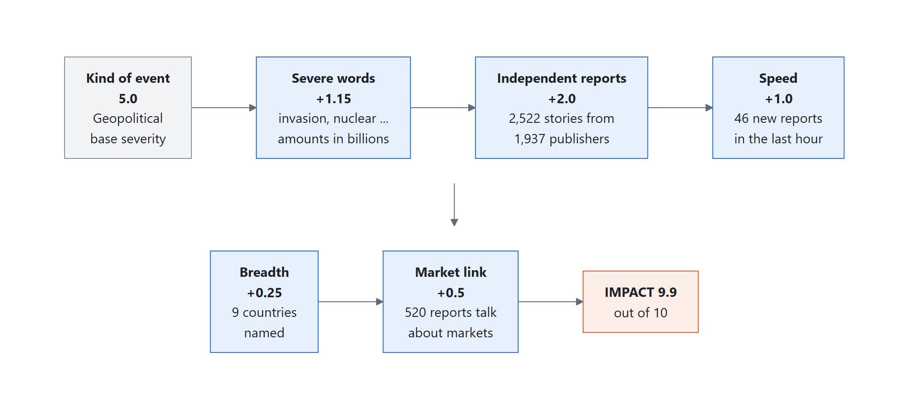

| Factor               | Points      | Rule, simply                                                                   |
| -------------------- | ----------- | ------------------------------------------------------------------------------ |
| Kind of event        | 1.0 to 5.5  | e.g. Geopolitical 5.0, Credit event 5.5, Macroeconomic 4.5, Product launch 2.5 |
| Severe words         | up to +1.5  | words like*invasion, default, collapse*, or amounts in billions              |
| Independent reports  | up to +2.0  | +0.5 every time the number of independent stories doubles                      |
| Speed                | up to +1.0  | 5, 15 or 40 new reports in the last hour                                       |
| Breadth              | up to +0.75 | 3 or more sectors, or 2 or more countries, named                               |
| Market link          | +0.5 or -1  | are people discussing it in market terms?                                      |
| Only on social media | -1          | no news outlet has reported it yet                                             |
| Only one report      | -1          | (-0.5 for only two)                                                            |
| Unsure of the type   | -0.5        | the model is less than 50% sure what kind of event it is                       |

The result is kept between 1 and 10. Because of the minus points, a single social-media post can never
reach the stress-test threshold of 7, and a single geopolitical article tops out at 6.75, so a
geopolitical stress test always needs at least a second, independent source.

### 5.6 A memory per company

Each company, country and commodity has a running sentiment score that:

- moves with every new piece of evidence, more for news than for social media (a post counts about a
  third as much as a news article);
- **fades back to neutral** when the news stops (it halves in about 36 hours for news, 12 hours for
  social media);
- reports **how sure it is**: one post gives a weak signal, twenty articles a strong one.

This is what Module A reads.

### 5.7 Guards against common mistakes

| Mistake                                                          | Guard                                                                                                                       |
| ---------------------------------------------------------------- | --------------------------------------------------------------------------------------------------------------------------- |
| "Ford" could be the carmaker or a person (Christine Blasey Ford) | ambiguous names only count with a finance clue nearby ("Ford shares", "Ford Motor")                                         |
| "Analyst downgrades Apple to Sell" is not a credit event         | broker rating changes are treated as market commentary, not credit risk                                                     |
| "A price war", "God of War", "a silent war" between shops        | "war" used as a figure of speech is not treated as geopolitical, unless the text has real conflict words or names a country |
| One viral post                                                   | social-only and single-source events lose points (section 5.5)                                                              |
| Reprints counted many times                                      | copies are folded into one story (section 5.4)                                                                              |
| Results changing between runs                                    | ties are broken the same way every time; a test checks this                                                                 |

### 5.8 How other programs get the signals

- **REST API** (FastAPI) with interactive docs at `http://127.0.0.1:8000/docs`, e.g. `GET /api/events`,
  `GET /api/entities`, `POST /api/analyze`, `GET /api/stress/runs`.
- **Live stream** (server-sent events) at `/api/stream`: the dashboard updates without refreshing.
- **A file**: every signal is also appended to `data/output/signals.jsonl`, one JSON object per line.

Each event signal carries the three fields the brief asks for (`sentiment_score`, `event_type`,
`impact_score`) plus the reasons, the entities, the number of independent stories and the evidence.

---

## 6. Module A - the index that listens to the news

**In short:** 20 large US stocks start at equal weights; good news raises a stock's weight, bad news
lowers it, within safety limits that real index providers use.

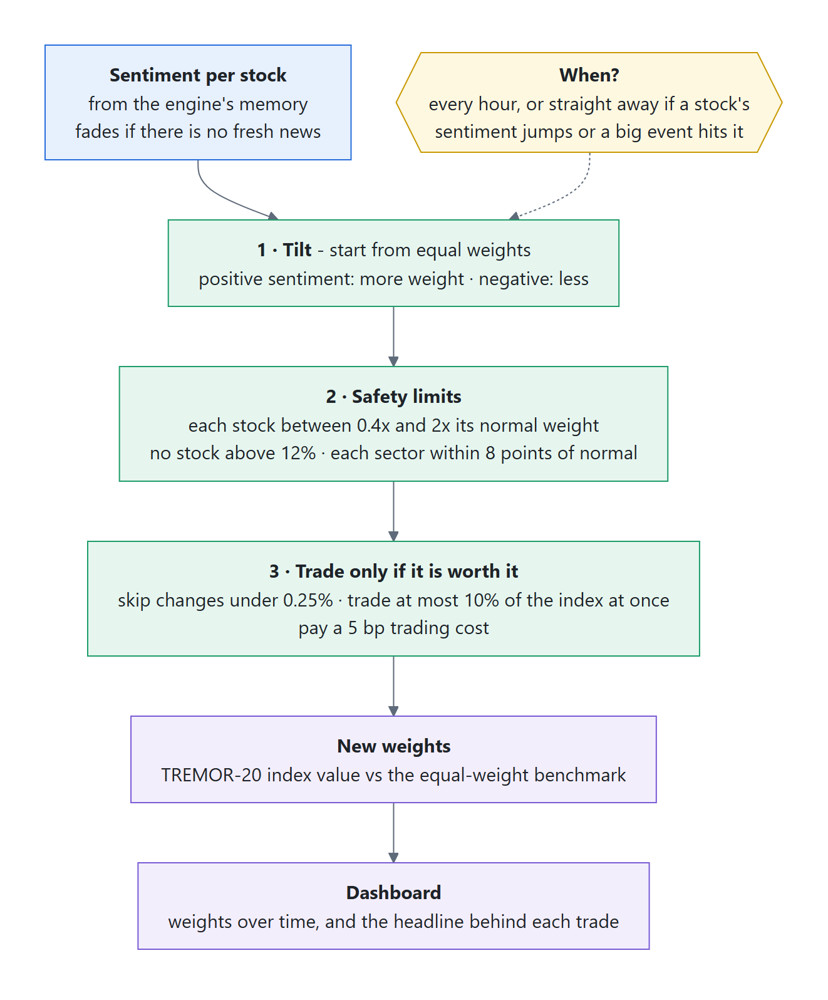

- **The index (TREMOR-20):** Apple, Microsoft, Nvidia, Amazon, Alphabet, Meta, Tesla, Netflix, Disney,
  Intel, AMD, Procter & Gamble, Coca-Cola, Costco, Boeing, Lockheed Martin, Verizon, JPMorgan, Exxon
  Mobil, Johnson & Johnson. That is 20 S&P 100 stocks from 8 sectors, each starting at 5%.
- **The tilt:** weight grows smoothly with sentiment (a sentiment of +0.35 roughly doubles a weight
  before the limits apply).
- **Why limits:** without them one lucky headline could put half the index into one stock. The limits
  keep it diversified and cheap to run, so it could actually be offered as an index.
- **Traceable:** every trade in the log shows the headline that caused it.
- **On the Ukraine replay:** 68 rebalances; JPMorgan was cut from 5% to 3.4% on sanctions news, and AMD
  rose to 7.1%.
- **One-year backtest** (Oct 2021 - Sep 2022, a falling market, 5 bp costs): TREMOR-20 returned -19.6%
  against -19.9% for equal weights (+0.32% a year). The naive keyword version lost 0.22% a year. One
  year of 20 stocks is too short to prove either signal works, and we say so openly.

---

## 7. Module B - the stress test that fires on big events

**In short:** when a confirmed event's impact goes above 7, TREMOR finds similar crises from history,
builds a scenario from what markets did then, and shows what it would do to the bank's book and capital.

### 7.1 The bank's book, built from the brief's transaction data

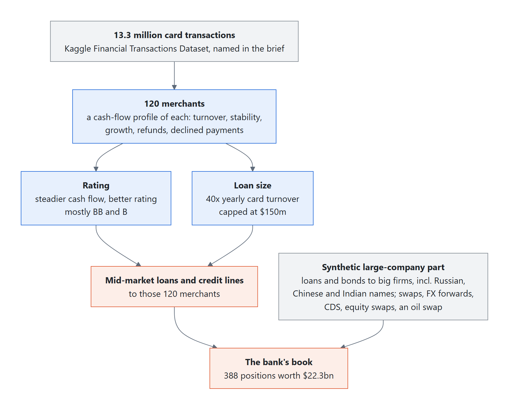

The brief names the Kaggle *Financial Transactions Dataset* (13.3 million card payments). We turned its
merchants into business borrowers. A merchant whose card income is steady gets a better rating; the loan
size is a multiple of its card income. A synthetic large-company part adds loans, bonds and derivatives
(including Russian, Chinese and Indian names, so geopolitical events have something to hit).

### 7.2 How a stress test runs

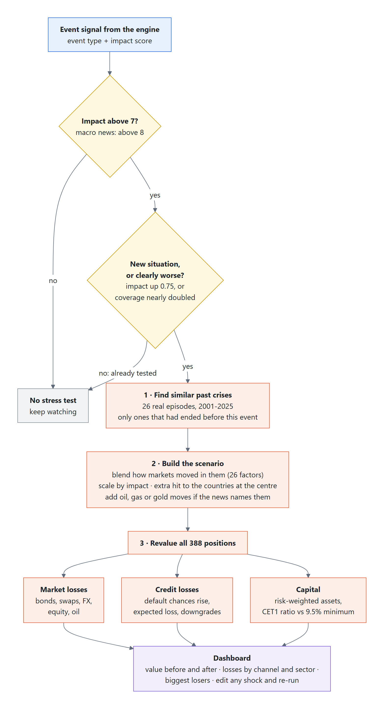

Credit terms in simple words:

| Term                                  | Meaning                                                                                                                                          |
| ------------------------------------- | ------------------------------------------------------------------------------------------------------------------------------------------------ |
| **PD** - probability of default | the chance a borrower fails to pay within a year. In a crisis it goes up; we shift it with the standard banking model (Vasicek)                  |
| **LGD** - loss given default    | how much of the loan is lost if the borrower defaults. It is worse in a downturn                                                                 |
| **ECL** - expected credit loss  | PD x LGD x amount owed: the provision a bank must hold under IFRS 9. Loans whose risk has jumped ("stage 2") must provision for their whole life |
| **RWA** - risk-weighted assets  | assets weighted by riskiness (Basel rules); riskier loans need more capital                                                                      |
| **CET1 ratio**                  | the bank's core capital divided by RWA: its safety cushion. Ours starts at 13.5%; the minimum is about 9.5%                                      |

### 7.3 The crisis, replayed

The stress test re-runs only when the situation clearly gets worse, so the bank sees an
**escalation ladder**, not a flood of alerts:

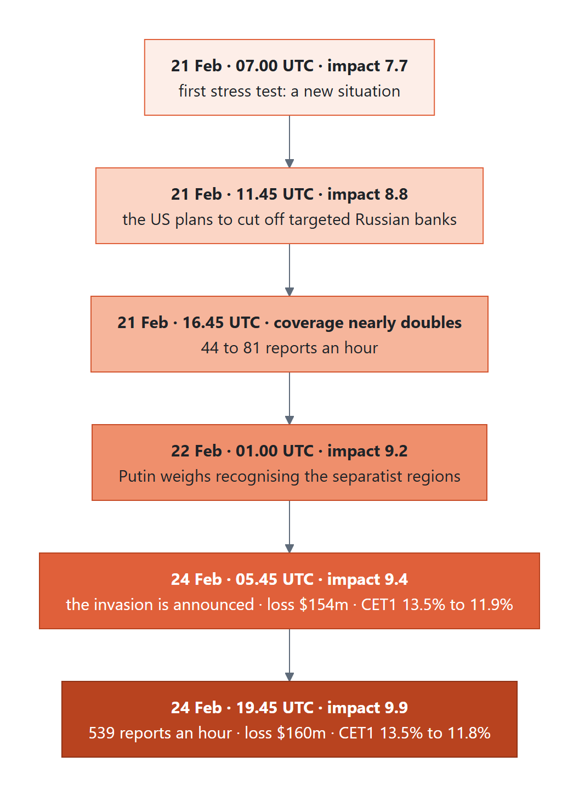

- At impact 9 and above, Sberbank and Gazprom are downgraded to default. The bank's own credit
  protection (CDS) on Gazprom pays out and softens the loss.
- **Was the scenario right?** We built it only from crises that ended *before* the invasion, then compared
  it with what markets actually did from 16 Feb to 8 Mar 2022. It got the **direction of 7 of 9 risk
  factors right** (junk-bond spreads: +59 bp predicted, +55 bp real). It missed oil and the euro, because
  no earlier crisis was a war-driven oil shock from a major exporter. We report that miss openly.
- **What-if:** an analyst can change any shock on the dashboard and re-run; the whole book revalues in
  milliseconds.

---

## 8. The dashboard

A browser app with five tabs. It works offline: no build step and no internet needed for the replay.

| Tab                                   | What you see                                                                                                                                                   |
| ------------------------------------- | -------------------------------------------------------------------------------------------------------------------------------------------------------------- |
| **Risk radar**                  | events ranked by impact, each with its scorecard, impact history, stories and evidence; sentiment per company; the live document feed                          |
| **Index rebalancer** (Module A) | index vs benchmark, a heatmap of weights over time, the rebalance log with the headline behind each trade                                                      |
| **Stress lab** (Module B)       | the stress tests run so far; value before and after; losses by channel and sector; the scenario and its historical analogs; biggest losses; the what-if editor |
| **Analyze text**                | paste any headline and see its sentiment, event type, impact and per-company tone                                                                              |
| **Model & results**             | accuracy against the baselines and FinBERT, speed, how the model was built                                                                                     |

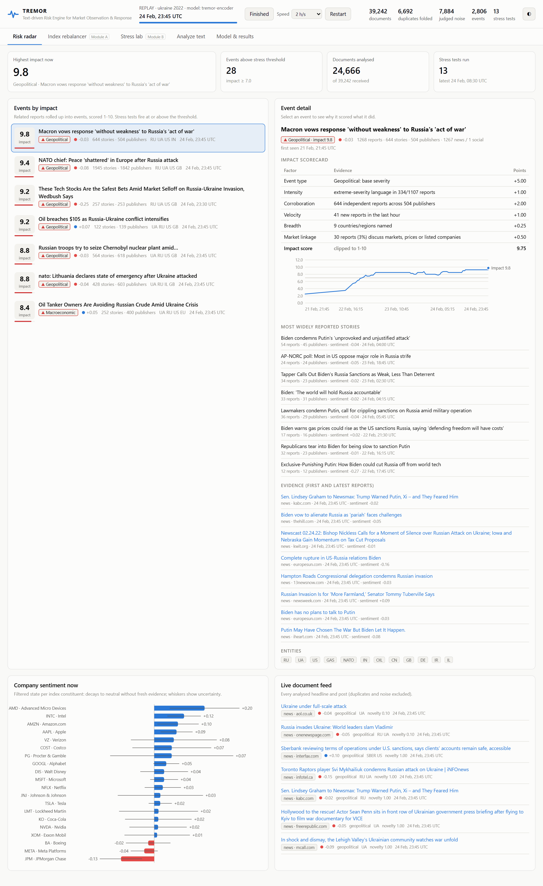


More screenshots of every tab, in light and dark themes, are in [`screenshots/`](screenshots/).

---

## 9. Results in plain numbers

Full tables: [`RESULTS.md`](RESULTS.md).

**Accuracy on held-out data** (data the model never saw; "0.830" means 83 out of 100 right):

| Task                                       | Keyword baseline (naive) | Frozen model + head | FinBERT | **TREMOR** |
| ------------------------------------------ | -----------------------: | ------------------: | ------: | ---------------: |
| News sentiment (PhraseBank)                |                    0.665 |               0.765 |  0.879* |  **0.830** |
| Tweet sentiment                            |                    0.703 |               0.763 |   0.714 |  **0.867** |
| Indian financial news                      |                    0.673 |               0.745 |   0.726 |  **0.870** |
| Sentiment towards a named target (FiQA)    |                    0.485 |               0.665 |   0.533 |  **0.709** |
| StockTwits posts                           |                    0.420 |               0.770 |   0.646 |  **0.814** |
| Event type (macro-F1)                      |                    0.377 |               0.778 |       - |  **0.880** |
| Two companies, opposite news, one headline |                    0.453 |               0.458 |       - |  **0.850** |
| Speed (headlines per second, laptop CPU)   |                    5,218 |                 492 |      61 |    **307** |

\* FinBERT was trained on PhraseBank, so its score there is partly on data it has seen.

**Efficiency gains vs the naive approach** (the guidelines ask the results slide to show these):

- **Accuracy:** much better than keyword matching on every task, e.g. event type 0.38 to 0.88 and
  StockTwits 42% to 81%. It also beats FinBERT on 4 of 5 sentiment tests.
- **Speed and size:** 5 times faster than FinBERT and 13 times smaller (34 MB vs 438 MB). It needs no GPU.
- **Less noise:** of 39,242 replayed documents, 6,692 were copies and 7,834 were noise. Instead of
  reacting to every headline, the bank saw **14 stress tests**, each tied to a real development.
- **Throughput:** four days of world news processed in 1.5-3 minutes on a laptop.

---

## 10. Replay or live - why the demo shows February 2022

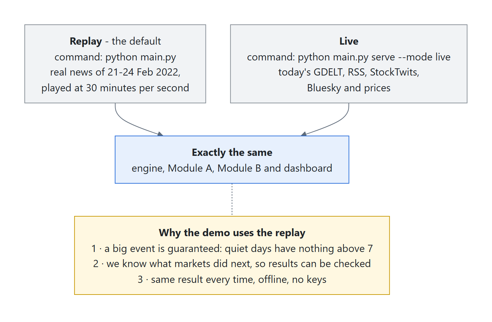

TREMOR works on today's news too: `python main.py serve --mode live` reads today's feeds. On
3 Oct 2026 it was tracking about 50 live events. The highest impact was 6.3, so no stress test fired,
which is correct for a quiet day. The demo uses the replay because a real crisis is guaranteed, the
outcome is known, and the result is the same every time. You can run both side by side (section 11).

---

## 11. How to run it

Python 3.10+ (tested on 3.12, Windows 11). CPU only, no keys.

```bash
pip install -r requirements.txt
python main.py                                  # replay demo  -> http://127.0.0.1:8000
python main.py serve --mode live --port 8001    # today's news -> http://127.0.0.1:8001
python main.py replay                           # whole replay without the browser, prints the results
python main.py analyze "Moody's cuts Boeing to junk"
pytest                                          # 84 automated tests
```

---

## 12. Where everything lives

```
main.py                    the one entry point (serve | replay | analyze | evaluate | backtest | train | finetune)
configs/                   the companies and countries we track, event types and keyword cues, past crises, settings
src/tremor/
  ingestion/               GDELT, RSS, StockTwits, Bluesky, replay, prices
  nlp/                     entity linking, keyword cues, the model, the impact scorecard
  engine/                  grouping into stories and events, sentiment memory, the pipeline, the live runtime
  modules/rebalancer/      Module A: methodology, live index, backtest
  modules/stress/          Module B: portfolio, credit maths, scenarios, stress engine
  training/                datasets, fine-tuning, evaluation
  api/                     the REST API and the dashboard
models/tremor-encoder/     the fine-tuned model (34 MB)
data/                      everything the prototype runs on (see data/README.md)
scripts/                   data collection, builders, benchmarks, diagram and screenshot tools
docs/                      architecture.png, this guide, RESULTS.md, diagrams/, screenshots/
tests/                     the automated tests
```

The diagrams in this guide are drawn from editable sources in [`diagrams/`](diagrams/) (`*.mmd`,
Mermaid). Re-draw them with `python scripts/render_diagrams.py`, which needs Playwright.

---

## 13. Limitations and next steps

- **Illustrative numbers:** the bank's book is synthetic, and ratings and exposure sizes are illustrative.
- **History has gaps:** a scenario built from past crises cannot foresee a new kind of shock (the oil
  miss). *Next:* search history using the commodities an event names, and add an LLM "scenario
  reviewer" for the rare high-impact events.
- **The backtest is short:** one year is not enough to prove the index beats its benchmark.
- **Figures of speech:** the model learned "war" as a strongly geopolitical word; a rule now catches common
  idioms. *Next:* retrain with idiom examples.
- **English only for now**, although GDELT covers 100+ languages. *Next:* a multilingual model.
- **Built for a demo, not a bank:** in production the in-process message bus would become Kafka or Redis
  Streams.

---

## 14. Glossary

| Word                                 | Meaning                                                                                                                                                                           |
| ------------------------------------ | --------------------------------------------------------------------------------------------------------------------------------------------------------------------------------- |
| **Sentiment**                  | how positive or negative a text is about something, from -1 to +1                                                                                                                 |
| **Event type**                 | the kind of news: Geopolitical, Macroeconomic, Credit event, Merger/Acquisition, Product launch, Earnings, Regulatory, Management, Operational incident, Market commentary, Other |
| **Impact score**               | 1-10, how much the event could move markets (section 5.5)                                                                                                                         |
| **Entity**                     | a company, country, central bank or commodity we track (80 in total)                                                                                                              |
| **GDELT**                      | a free global news database that publishes new headlines every 15 minutes                                                                                                         |
| **RSS**                        | a simple feed format that news sites use to publish their latest headlines                                                                                                        |
| **API**                        | a way for programs to ask TREMOR for its signals                                                                                                                                  |
| **Fine-tuning**                | further training of an existing AI model on our own labelled examples                                                                                                             |
| **Meaning vector (embedding)** | a list of numbers that captures what a text means; similar texts get similar vectors                                                                                              |
| **ONNX, 8-bit**                | a portable model format, with numbers stored more compactly so the model is smaller and faster                                                                                    |
| **Baseline**                   | a simple method we compare against, to prove the clever one is worth it                                                                                                           |
| **Macro-F1**                   | an accuracy score that treats rare and common event types equally                                                                                                                 |
| **Rebalance / turnover**       | changing the index weights / how much of the index was traded                                                                                                                     |
| **bp (basis point)**           | 0.01%. 5 bp = 0.05%                                                                                                                                                               |
| **Backtest**                   | testing a strategy on past data as if it had been run at the time                                                                                                                 |
| **Information ratio**          | extra return over the benchmark per unit of extra risk                                                                                                                            |
| **Stress test**                | "what would this crisis do to our portfolio?"                                                                                                                                     |
| **Historical analog**          | a past crisis that resembles today's event                                                                                                                                        |
| **CDS**                        | insurance against a borrower defaulting                                                                                                                                           |
| **Swap / FX forward / TRS**    | derivatives: contracts whose value moves with interest rates, currencies or share prices                                                                                          |
| **PD, LGD, ECL, RWA, CET1**    | see the table in section 7.2                                                                                                                                                      |
